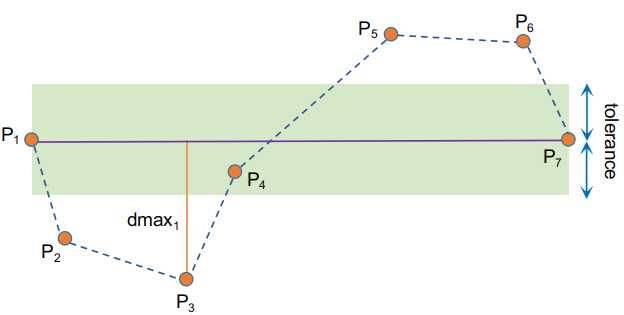
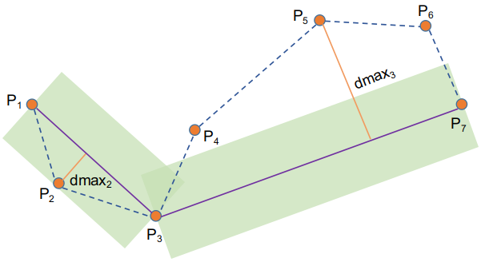
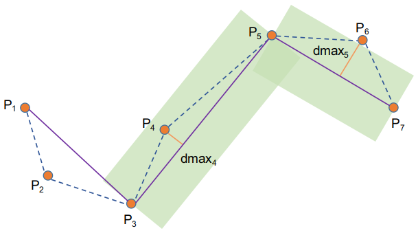
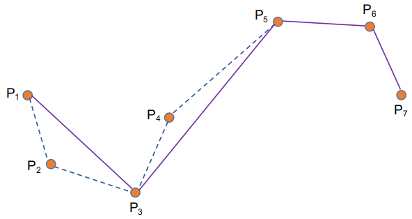
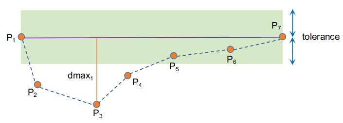
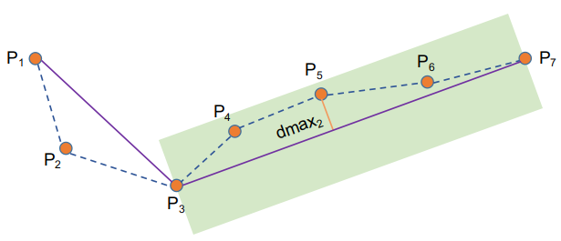
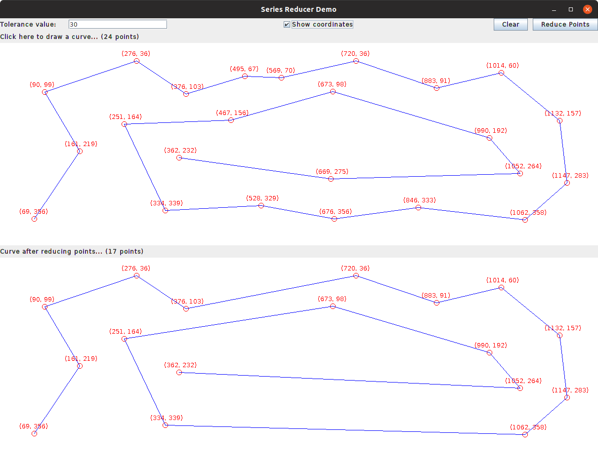
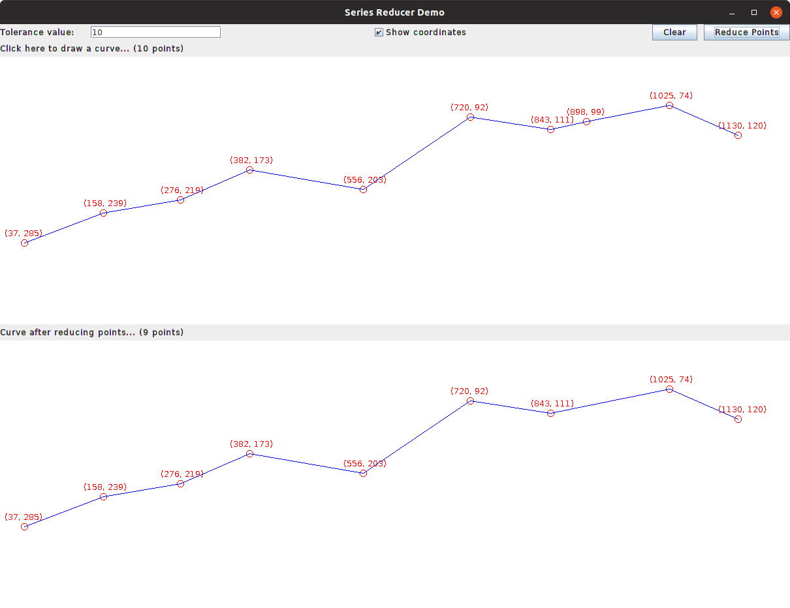
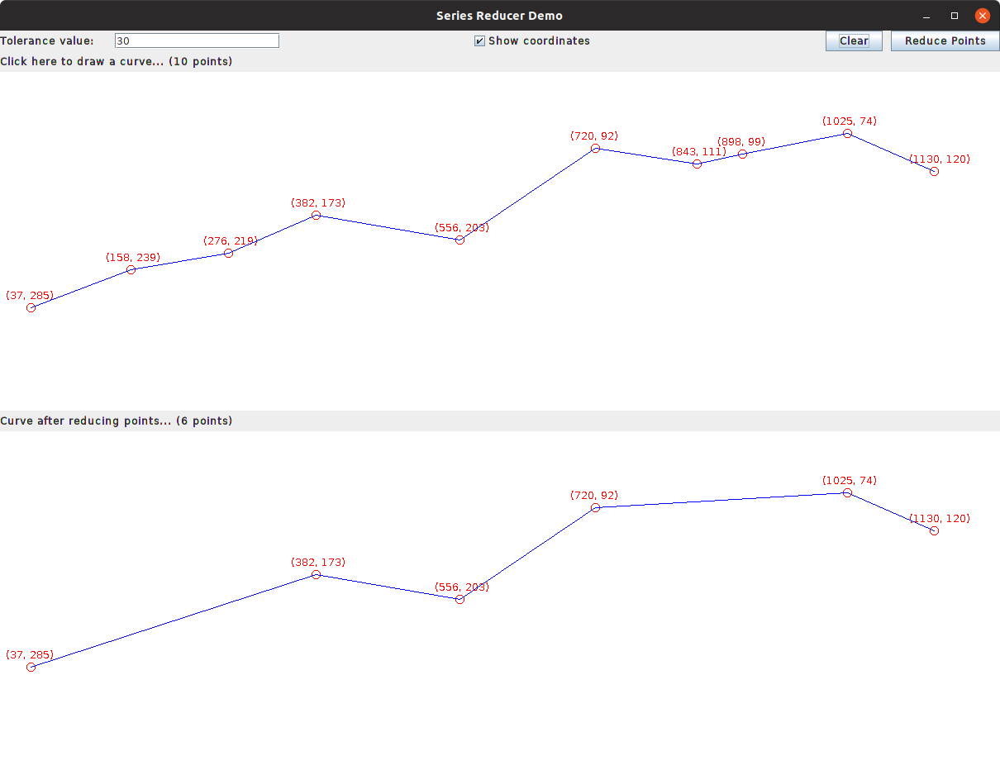
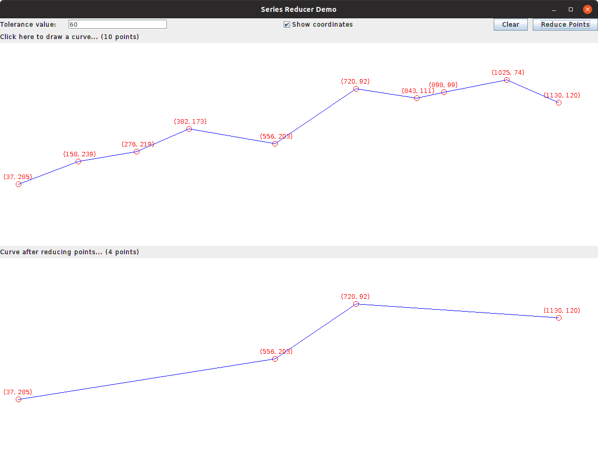

## Reduce points series using Ramer Douglas Peucker algorithm

### 1. Problem

In the vehicle IoT system you will get a huge data of vehicles related to sensors, state, gps,... information. To monitor or track routes/journeys of a vehicle we need to render gps information in the given period.
The problem is that rendering a long route will take a lot of time due to big data while there are many points we can reduce in the viewer.

### 2. Solution

We will apply solution to reduce unnecessary points using **Ramer Douglas Peucker (RDP)** algorithm to find a similar curve with fewer points. The algorithm defines 'dissimilar' based on the maximum distance between the original curve and the simplified curve (i.e., the Hausdorff distance between the curves). The simplified curve consists of a subset of the points that defined the original curve.

Given a distance dimension tolerance ε > 0 and all the points between the first and last point. The algorithm will find the furthest distance from other points to the line connects the first and the last points. If the point has furthest distance is greater than ε from the approximation then that point must be kept. The algorithm recursively calls itself with the first point and the furthest point and then with the furthest point and the last point, which includes the furthest point being marked as kept. Otherwise, any points that are different with the first and the last points will be discarded.

**Example 1**

Given a tolerance value (ε > 0) and 7 points (P1, P2,..., P7) with the order as above.

* **Step 1:** Found P3 that has max distance to the line P1P7 and this distance is greater than ε, therefore, we separate the origin set (P1, P2,..., P7) into 2 subset points: (P1, P2, P3) and (P3, P4, P5, P6, P7) and continue applying **RDP** to these two subsets.

* **Step 2:**

For the first subset the dmax2 is smaller than ε, hence, we can discard the P2.

For the second subset the dmax3 > ε so we continue separating (P3, P4, P5, P6, P7) into 2 subsets (P3, P4, P5) and (P5, P6, P7).

* **Step 3:**

For the subset (P3, P4, P5) the max distance dmax4 < ε, therefore, the point P4 is discarded.

For the subset (P5, P6, P7), the max distance dmax5 > ε, hence we keep all P5, P6, P7 points.

The final simplified curve is P1, P3, P5, P6, P7 (5 points) as above.

**Example 2**

By doing the same steps we have the last simplified curve is P1, P3, P7 

### 3. Application Demo

Demo application is written in Java Swing to demonstrate how the algorithm does. We can input the points series directly on screen. For GPS data you can input double array list (an array of double x, y coordinates) of longitude and latitude data.

**If ε = 10** the simplified curve has 9 points

**If ε = 30** the simplified curve has 6 points

**If ε = 60** the simplified curve has 4 points

### 4. References

https://en.wikipedia.org/wiki/Ramer%E2%80%93Douglas%E2%80%93Peucker_algorithm